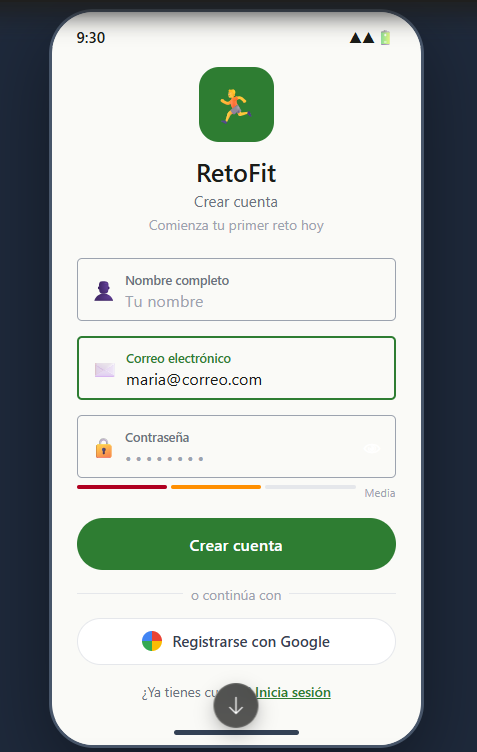
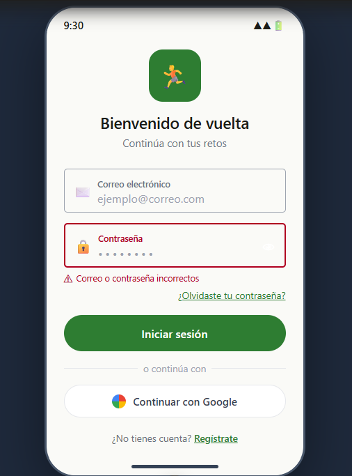
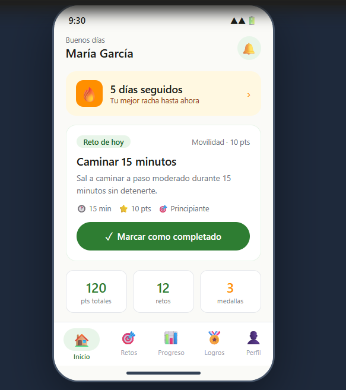
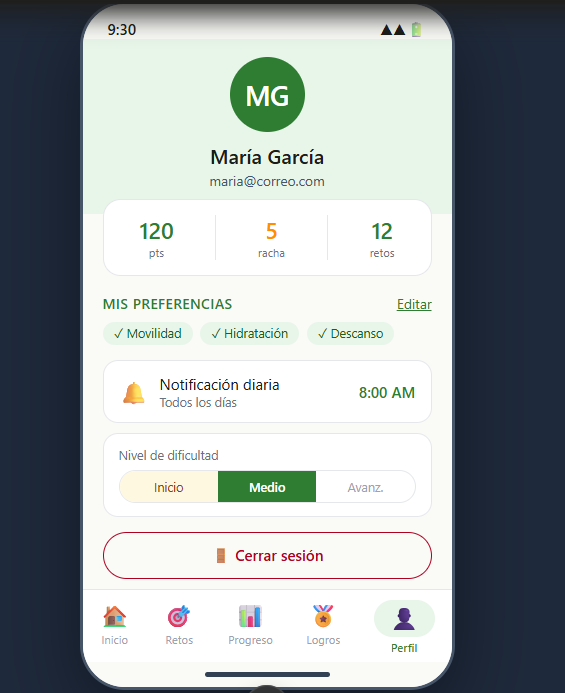
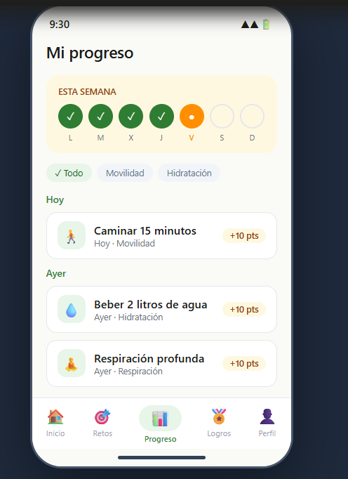
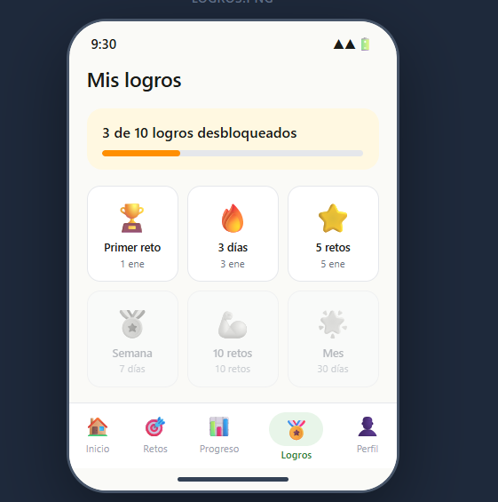

# 🏃 RetoFit

> Aplicación Android para mantener hábitos saludables mediante retos diarios simples y un sistema de gamificación.


---

## 📋 Descripción del problema

Las personas ocupadas, como estudiantes y profesionales, tienen la intención de mantener hábitos saludables pero carecen de constancia para lograrlo. Las aplicaciones de salud existentes proponen rutinas complejas, requieren equipamiento adicional o resultan aburridas, lo que lleva al abandono en menos de una semana.

**RetoFit** resuelve este problema ofreciendo un único reto diario simple y alcanzable, acompañado de un sistema de puntos, rachas y medallas que refuerza la motivación del usuario día a día.

---

## 🎯 Objetivo de la aplicación

Desarrollar una aplicación móvil Android que motive a los usuarios a mantener hábitos saludables mediante retos físicos diarios simples y alcanzables, logrando que al menos el **70% de los usuarios cumplan con un reto por día durante las primeras cuatro semanas de uso**.

---

## 👤 Usuario objetivo

Personas ocupadas (estudiantes y profesionales) que desean mantener una vida saludable sin necesidad de rutinas complejas ni equipamiento adicional.

---

## 📖 Historias de usuario del MVP

| ID | Historia | Prioridad |
|----|----------|-----------|
| HU-01 | Como profesional con poco tiempo libre, quiero recibir una notificación diaria con un reto simple y alcanzable, para recordar mantener mis hábitos saludables sin interrumpir mi rutina. | 🔴 Alta |
| HU-02 | Como nuevo usuario de la app, quiero indicar mis preferencias de tipo de actividad y nivel de dificultad al registrarme, para recibir retos que se adapten a mis capacidades reales y no abandonar desde el inicio. | 🔴 Alta |
| HU-03 | Como usuario que suele abandonar sus rutinas, quiero ganar puntos y ver un mensaje de felicitación al completar cada reto, para sentirme motivado a seguir al día siguiente. | 🔴 Alta |
| HU-04 | Como usuario que acaba de comenzar en la app, quiero consultar el historial de mis retos completados y las medallas obtenidas, para visualizar mi progreso y sentir que estoy avanzando. | 🟡 Media |
| HU-05 | Como administrador de la plataforma, quiero poder agregar, editar y desactivar retos desde un panel de gestión, para mantener el contenido actualizado y alineado con hábitos saludables validados. | 🟡 Media |
| HU-06 | Como usuario que tiende a perder el hilo de sus hábitos, quiero ver cuántos días consecutivos he completado mis retos, para sentir presión positiva de no romper mi racha. | 🟡 Media |

---

## 🛠️ Tecnología utilizada

| Capa | Tecnología |
|------|------------|
| Lenguaje | Kotlin |
| IDE | Android Studio |
| UI | Jetpack Compose + Material Design 3 |
| Base de datos remota | Supabase (PostgreSQL) |
| Base de datos local | Room / SQLite |
| Configuración local | SharedPreferences |
| Notificaciones | WorkManager |
| Control de versiones | Git + GitHub |

### Paleta de colores (Material Design 3)

| Token | Color | HEX |
|-------|-------|-----|
| Primary | Verde Bosque | `#2E7D32` |
| Secondary | Ámbar Energía | `#FF8F00` |
| Background | Crema Natural | `#FAFAF7` |
| Error | Rojo MD3 | `#B00020` |

---

## 📱 Capturas de pantalla

> _Prototipo desarrollado en Figma_

| Registro | Login | Inicio |
|----------|-------|--------|
|  |  |  |

| Perfil | Historial | Logros |
|--------|-----------|--------|
|  |  |  |

> 📌 _Las capturas serán actualizadas con pantallas reales conforme avance el desarrollo._

---

## ⚙️ Instrucciones de instalación

### Requisitos previos

- Android Studio Hedgehog o superior
- JDK 17
- Android SDK API 26 o superior
- Git instalado

### Pasos

1. **Clona el repositorio**
   ```bash
   git clone https://github.com/Pjgalarraga/RetofitApp.git
   ```

2. **Abre el proyecto en Android Studio**
   ```
   File → Open → selecciona la carpeta RetofitApp
   ```

3. **Sincroniza las dependencias de Gradle**
   ```
   Android Studio lo hace automáticamente al abrir el proyecto.
   Si no, ve a File → Sync Project with Gradle Files
   ```

4. **Configura el emulador o conecta un dispositivo Android**
   ```
   API 26 (Android 8.0) o superior
   ```

5. **Ejecuta la aplicación**
   ```
   Presiona el botón ▶ Run o usa Shift + F10
   ```

---

## 📊 Modelo de datos

La aplicación maneja 5 entidades principales:

- **Usuario** — datos de cuenta, preferencias, puntos y racha
- **Reto** — catálogo de actividades saludables gestionado por el admin
- **Progreso** — registro de cada reto completado por cada usuario
- **LogroDefinicion** — catálogo de medallas disponibles
- **LogroUsuario** — medallas desbloqueadas por cada usuario

---

## 🚦 Estado actual del proyecto

```
✅ Definición del problema y objetivo
✅ Historias de usuario del MVP
✅ Modelo de datos (entidades y relaciones)
✅ Arquitectura de almacenamiento definida
✅ Paleta de colores Material Design 3
✅ Prototipo de pantallas en Figma
✅ Repositorio GitHub configurado
⬜ Implementación de pantalla de Registro
⬜ Implementación de pantalla de Login
⬜ Implementación de pantalla de Inicio
⬜ Implementación de pantalla de Perfil
⬜ Implementación de pantalla de Historial
⬜ Implementación de pantalla de Logros
⬜ Integración con Supabase
⬜ Sistema de notificaciones con WorkManager
⬜ Pruebas de usabilidad con usuarios reales
```

---

## 👨‍💻 Autor

**Pedro Galarraga**
- GitHub: [@Pjgalarraga](https://github.com/Pjgalarraga)
- Email: pjgalarraga@uce.edu.ec

---

## 📄 Licencia

Este proyecto fue desarrollado como entregable académico.

---

<p align="center">
  Hecho con 💚 para construir mejores hábitos, un reto a la vez.
</p>
